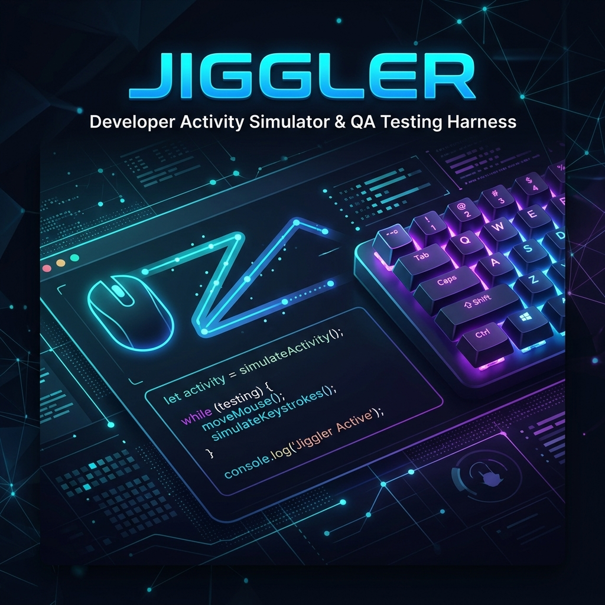
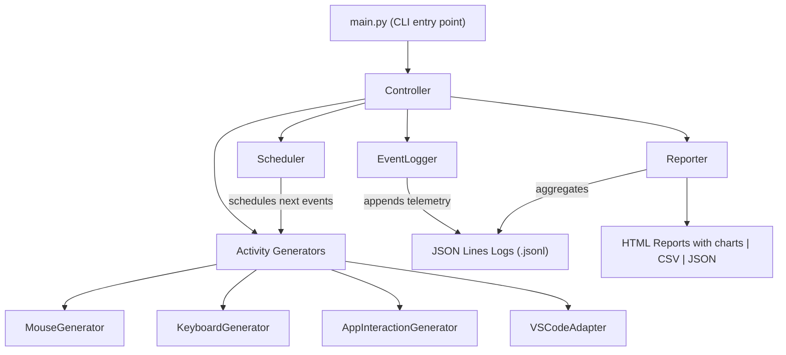

# Developer Activity Simulator (Jiggler)



<p align="center">
  
  
  
  
</p>

---

## 📋 Overview

**Developer Activity Simulator** (codenamed **Jiggler**) is a highly configurable workstation simulation and QA validation harness. It is designed specifically for security, IT operations, and QA teams to validate the behavior, precision, threshold reliability, and timeout configurations of employee monitoring, DLP (Data Loss Prevention), and workstation idle-detection systems.

> [!WARNING]  
> **INTENDED USE ONLY:** This tool is strictly intended for QA testing, benchmarking, and security validation in authorized, controlled environments. Using this software to bypass, deceive, or falsify active workspace productivity metrics is a violation of typical enterprise policies and is strongly discouraged.

---

## ✨ Key Features

Jiggler uses multi-layered input automation to simulate genuine human-developer interactions:

*   **🖱️ Mouse Activity Engine**
    *   Generates human-like cursor movements along realistic curved paths (Bezier/sinusoidal interpolation).
    *   Simulates mouse click types (left, right, double clicks) and scrolling behaviors.
    *   Supports configurable movement speeds, frequencies, and target bounding boxes.
*   **⌨️ Advanced Keyboard Simulator**
    *   Types realistic text sequences and programming snippets with words-per-minute (WPM) speed modeling.
    *   Introduces human-like typing cadences, random pauses, and minor typos/backspaces.
    *   Supports key combinations, hotkeys (Copy, Paste, Undo), and modifier sequences.
*   **💻 IDE & Application Adapters**
    *   **VS Code Automation:** Automates launching VS Code, opening test projects, creating workspace files, navigating tabs, searching for code patterns, executing command line runs in the integrated terminal, and auto-saving work.
    *   **Window Management:** Switches active windows, minimizes/restores applications, and alters process focus using native OS APIs (`pywinauto` on Windows with OS-agnostic fallbacks).
*   **⚙️ Advanced Scheduling**
    *   Supports 4 custom scheduling strategies (Deterministic, Interval-based, Poisson-distribution, Burst).
    *   Features random seed inputs (`--seed`) for reproducing exact test scenario runs down to the millisecond.

---

## 🛠️ Architecture

Jiggler is built on a modular, adapter-based framework. The central `Controller` manages the environment state and triggers action steps planned by the `Scheduler`, logging telemetry details in real-time.



---

## 📈 Test Scenarios

The simulator executes workstation patterns based on five target testing scenarios:

| Scenario | Identifier | Activity Signature | Target Use Case |
| :--- | :--- | :--- | :--- |
| **Continuous** | `continuous` | Steady, uninterrupted mouse & keyboard actions. | Stress testing baseline tracking metrics. |
| **Intermittent** | `intermittent` | Periodic high-activity bursts followed by distinct idle gaps. | Verifying idle-state detection thresholds. |
| **Edge Timeout** | `edge_timeout` | Long idleness, waking up shortly before timeout limits. | Validating reset behavior on threshold boundaries. |
| **Long Duration** | `long_duration` | Multi-hour runs with background telemetry self-checks. | Confirming tool stability and memory efficiency. |
| **Randomized** | `randomized` | Unpredictable, fully randomized timings and generators. | General fuzzing of monitoring agent heuristics. |

---

## 🚀 Getting Started

### Prerequisites

*   Python 3.11 or higher
*   Operating System: Windows 10/11 or Ubuntu Linux 22.04+

### Setup

1. Clone the repository:
   ```bash
   git clone https://github.com/gautamhitesh/jiggler.git
   cd jiggler
   ```

2. Install dependencies:
   ```bash
   pip install -r requirements.txt
   ```

3. Run the test suite to ensure all adapters are fully operational:
   ```bash
   pytest
   ```

### Quick Start Examples

Run the tool using the default configuration (defined in `config.yaml`):
```bash
python main.py
```

Run a 5-minute dry-run (logs activities without sending hardware input events):
```bash
python main.py --dry-run --duration 5 --scenario continuous
```

Run a specific scenario with a fixed random seed for deterministic reproduction:
```bash
python main.py --scenario edge_timeout --seed 42 --duration 30
```

Enable debug logs and output reporting details to a custom folder:
```bash
python main.py --verbose --report-dir ./custom_reports_dir
```

---

## ⚙️ Configuration Guide

The simulator behavior is defined in `config.yaml`. A sample configuration template is provided below:

```yaml
# Total execution duration in minutes
duration_minutes: 60

# Activity toggles
mouse_enabled: true
keyboard_enabled: true
vscode_enabled: true

# Probability of idle periods between actions (0.0 - 1.0)
idle_probability: 0.25

# Typing speed in words per minute
typing_speed_wpm: 50

# Average mouse movement interval (seconds)
mouse_move_interval: 3.0

# Random seed for deterministic runs (null for non-deterministic)
random_seed: 12345

# Active scenario: continuous | intermittent | edge_timeout | long_duration | randomized
scenario: randomized

# Report output formats
report_formats:
  - json
  - csv
  - html

# Output paths
report_dir: ./reports
log_dir: ./logs

# Applications for focus switching
target_applications:
  - "Visual Studio Code"
  - "Windows Terminal"
  - "Google Chrome"

# VS Code specific workspace configuration
vscode:
  workspace_path: ./test_workspace
  auto_save_interval: 30
```

---

## 📊 Telemetry and Post-Run Reports

Every simulation run records structured events in append-only JSON Lines format.

### Log Output Sample
```json
{"timestamp": "2026-06-16T12:30:15Z", "event": "mouse_move", "details": {"x": 500, "y": 420}, "application": "Visual Studio Code"}
{"timestamp": "2026-06-16T12:30:18Z", "event": "keyboard_type", "details": {"chars": 12}, "application": "Visual Studio Code"}
```

### Generated Report Structure
At shutdown (or upon termination by `Ctrl+C`), Jiggler generates structured summaries in JSON, CSV, and a beautiful dark-mode HTML format featuring matplotlib visualization charts.

```json
{
  "session_id": "20260616_114128",
  "total_runtime_seconds": 3600.0,
  "total_events": 1205,
  "successful_events": 1205,
  "failed_events": 0,
  "activity_counts": {
    "keyboard": 450,
    "mouse": 520,
    "vscode": 180,
    "app_interaction": 55
  },
  "idle_duration_seconds": 900.0,
  "total_errors": 0
}
```

---

## 🛡️ License

This project is licensed under the MIT License. See the `LICENSE` file for details (if available).
