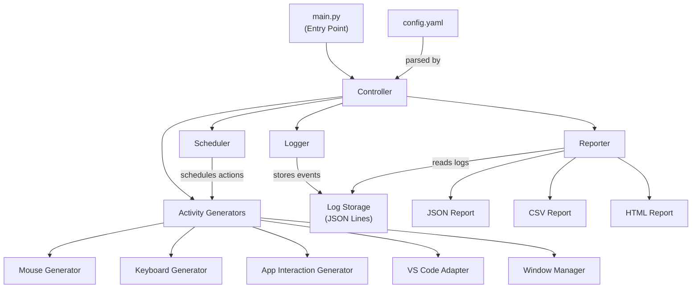

# Developer Activity Simulator — Implementation Plan

## Goal

Build a configurable Python testing harness that simulates workstation activity (mouse, keyboard, VS Code interaction, window management) to validate developer monitoring system behavior. Per the [technical.md](file:///d:/Code/jiggler/technical.md), the tool is for QA/testing/benchmarking only.

---

## Open Questions

> [!IMPORTANT]
> **Q1 — Virtual environment approach**: Should I use `venv` or are you managing dependencies separately (e.g., conda, poetry)? I'll default to creating a `requirements.txt` and a `venv` setup.

> [!IMPORTANT]
> **Q2 — Test file directory**: The VS Code Adapter needs test files to open/edit. Should I create a `test_workspace/` directory with sample files (Python, JS, Markdown), or do you have an existing directory to target?

> [!IMPORTANT]
> **Q3 — HTML report template**: The TRD calls for HTML report output. I'll use Jinja2 templates with a clean, modern design. Any branding preferences?

---

## Proposed Architecture



---

## Proposed Changes

### Project Structure

```
d:\Code\jiggler\
├── main.py                          # CLI entry point
├── config.yaml                      # Default configuration
├── requirements.txt                 # Dependencies
├── technical.md                     # (existing)
│
├── simulator/                       # Core package
│   ├── __init__.py
│   ├── controller.py                # Orchestrates test execution
│   ├── scheduler.py                 # Determines action timing
│   ├── config.py                    # Pydantic config models
│   │
│   ├── generators/                  # Activity generators (plugin-style)
│   │   ├── __init__.py
│   │   ├── base.py                  # Abstract base generator
│   │   ├── mouse.py                 # Mouse activity generator
│   │   ├── keyboard.py              # Keyboard activity generator
│   │   ├── app_interaction.py       # App launch/switch/window mgmt
│   │   └── vscode_adapter.py        # VS Code specific interactions
│   │
│   ├── scenarios/                   # Predefined test scenarios
│   │   ├── __init__.py
│   │   ├── base.py                  # Abstract base scenario
│   │   ├── continuous.py            # Scenario A
│   │   ├── intermittent.py          # Scenario B
│   │   ├── edge_timeout.py          # Scenario C
│   │   ├── long_duration.py         # Scenario D
│   │   └── randomized.py           # Scenario E
│   │
│   ├── logging/                     # Logging & telemetry
│   │   ├── __init__.py
│   │   └── event_logger.py          # Structured event logger
│   │
│   └── reporting/                   # Report generation
│       ├── __init__.py
│       ├── reporter.py              # Report orchestrator
│       └── templates/
│           └── report.html.j2       # Jinja2 HTML template
│
├── test_workspace/                  # Sample files for VS Code adapter
│   ├── sample.py
│   ├── sample.js
│   └── notes.md
│
└── tests/                           # Unit & integration tests
    ├── __init__.py
    ├── test_config.py
    ├── test_scheduler.py
    ├── test_mouse_generator.py
    ├── test_keyboard_generator.py
    ├── test_reporter.py
    └── test_scenarios.py
```

---

### Core Package — `simulator/`

#### [NEW] [config.py](file:///d:/Code/jiggler/simulator/config.py)

Pydantic models for all configuration parameters:

- `SimulatorConfig` — top-level config with fields: `duration_minutes`, `mouse_enabled`, `keyboard_enabled`, `vscode_enabled`, `idle_probability`, `typing_speed_wpm`, `random_seed`, `scenario`, `logging_verbosity`, `report_formats`, `target_applications`
- Validation: ensure `duration_minutes > 0`, `0 <= idle_probability <= 1`, `typing_speed_wpm` within sane range
- YAML loading via `pyyaml` with Pydantic validation
- Support both CLI arg overrides and config file

#### [NEW] [controller.py](file:///d:/Code/jiggler/simulator/controller.py)

Central orchestrator:

- Initializes all generators, scheduler, logger, and reporter
- Runs the main execution loop with graceful shutdown (`signal` handlers for SIGINT/SIGTERM)
- Handles crash recovery — wraps generator calls in try/except, logs failures, continues execution
- Tracks overall session state (start time, active scenario, elapsed time)
- Seeds the `random` module from config for deterministic runs

#### [NEW] [scheduler.py](file:///d:/Code/jiggler/simulator/scheduler.py)

Action timing engine:

- Maintains a priority queue of upcoming actions
- Supports scenario-specific timing profiles (continuous, bursty, edge-timeout)
- Generates idle periods based on `idle_probability` config
- Uses the seeded RNG for reproducibility
- Yields `ScheduledAction(timestamp, generator_type, action_name)` objects

---

### Activity Generators — `simulator/generators/`

#### [NEW] [base.py](file:///d:/Code/jiggler/simulator/generators/base.py)

Abstract base class `BaseGenerator`:

- `execute(action_name: str) -> ActivityEvent` — runs one action
- `get_available_actions() -> list[str]` — returns all supported action names
- `is_available() -> bool` — checks platform/dependency availability
- Common error handling and logging mixin

#### [NEW] [mouse.py](file:///d:/Code/jiggler/simulator/generators/mouse.py)

`MouseGenerator(BaseGenerator)`:

- `move_realistic(target_x, target_y)` — Bézier curve interpolation for natural paths using `pyautogui`
- `move_random()` — random screen coordinates
- `click(button='left')` — click at current position
- `idle(duration)` — do nothing for specified time
- Configurable movement frequency via config

#### [NEW] [keyboard.py](file:///d:/Code/jiggler/simulator/generators/keyboard.py)

`KeyboardGenerator(BaseGenerator)`:

- `type_text(text, wpm)` — types text at configurable speed with realistic inter-key delays
- `type_code_snippet()` — picks from built-in code snippet templates
- `press_key(key)` — single keypress
- `press_hotkey(*keys)` — e.g., Ctrl+S
- Pause simulation between keystrokes using Gaussian distribution around target WPM
- Built-in snippet library: Python functions, JS classes, markdown paragraphs

#### [NEW] [app_interaction.py](file:///d:/Code/jiggler/simulator/generators/app_interaction.py)

`AppInteractionGenerator(BaseGenerator)`:

- `launch_app(app_name)` — launches target application
- `bring_to_foreground(window_title)` — uses `pywinauto` on Windows, fallback to `pyautogui` elsewhere
- `switch_app()` — Alt+Tab simulation
- `minimize_window()` / `restore_window()`
- `focus_change()` — clicks on different window areas

#### [NEW] [vscode_adapter.py](file:///d:/Code/jiggler/simulator/generators/vscode_adapter.py)

`VSCodeAdapter(BaseGenerator)`:

- `launch()` — opens VS Code with the test workspace folder
- `open_file(filepath)` — uses Ctrl+P quick open
- `create_new_file(filename)` — creates via Ctrl+N and save
- `switch_tab()` — Ctrl+Tab / Ctrl+PageDown
- `scroll(direction, lines)` — PageUp/PageDown or mouse scroll
- `save_file()` — Ctrl+S
- `edit_content()` — delegates to KeyboardGenerator for typing
- Uses `pywinauto` to verify VS Code window state on Windows

---

### Scenarios — `simulator/scenarios/`

#### [NEW] [base.py](file:///d:/Code/jiggler/simulator/scenarios/base.py)

Abstract `BaseScenario`:

- `configure(scheduler, generators, config)` — sets up the scenario
- `get_action_sequence() -> Iterator[ScheduledAction]` — yields actions in order
- `name` property

#### [NEW] Scenario implementations (one file each)

| File | Scenario | Behavior |
|------|----------|----------|
| [continuous.py](file:///d:/Code/jiggler/simulator/scenarios/continuous.py) | A — Continuous | Steady stream of actions, minimal idle |
| [intermittent.py](file:///d:/Code/jiggler/simulator/scenarios/intermittent.py) | B — Intermittent | Bursts of 2-5 min activity, 1-3 min idle |
| [edge_timeout.py](file:///d:/Code/jiggler/simulator/scenarios/edge_timeout.py) | C — Edge Timeout | Idle until `timeout_threshold - delta`, then act |
| [long_duration.py](file:///d:/Code/jiggler/simulator/scenarios/long_duration.py) | D — Long Duration | Same as A but designed for 8+ hour runs with periodic health checks |
| [randomized.py](file:///d:/Code/jiggler/simulator/scenarios/randomized.py) | E — Randomized | Fully random action types, random delays |

---

### Logging — `simulator/logging/`

#### [NEW] [event_logger.py](file:///d:/Code/jiggler/simulator/logging/event_logger.py)

- Writes structured JSON Lines (`.jsonl`) log files
- Each event: `{ timestamp, event_type, action, application, success, error_message, details }`
- Supports configurable verbosity levels (DEBUG, INFO, WARN, ERROR)
- Thread-safe writes
- Also logs to Python's standard `logging` module for console output
- Log rotation for long-duration runs

---

### Reporting — `simulator/reporting/`

#### [NEW] [reporter.py](file:///d:/Code/jiggler/simulator/reporting/reporter.py)

- Reads the `.jsonl` log file after test completion
- Uses `pandas` for aggregation:
  - Total runtime
  - Activity counts by type
  - Idle duration totals
  - Error event summary
  - Timeout occurrence count
- Outputs:
  - **JSON**: Raw summary dict
  - **CSV**: Tabular summary via pandas
  - **HTML**: Rendered via Jinja2 template with charts (matplotlib-generated PNGs embedded as base64)

#### [NEW] [report.html.j2](file:///d:/Code/jiggler/simulator/reporting/templates/report.html.j2)

- Clean HTML template with:
  - Header with run metadata
  - Summary statistics cards
  - Activity breakdown table
  - Timeline chart (embedded matplotlib image)
  - Error log section

---

### Entry Point

#### [NEW] [main.py](file:///d:/Code/jiggler/main.py)

- CLI using `argparse`:
  - `--config` — path to YAML config (default: `config.yaml`)
  - `--scenario` — override scenario (A/B/C/D/E)
  - `--duration` — override duration in minutes
  - `--seed` — override random seed
  - `--dry-run` — log actions without executing them
  - `--report-dir` — output directory for reports
- Prints clear banner identifying tool as "Developer Activity Simulator — TEST HARNESS"
- Initializes controller and runs

#### [NEW] [config.yaml](file:///d:/Code/jiggler/config.yaml)

Default configuration file matching the TRD schema.

#### [NEW] [requirements.txt](file:///d:/Code/jiggler/requirements.txt)

```
pyautogui>=0.9.54
pynput>=1.7.6
pywinauto>=0.6.8; sys_platform == "win32"
pydantic>=2.0
pyyaml>=6.0
pandas>=2.0
jinja2>=3.1
matplotlib>=3.7
```

---

### Test Workspace

#### [NEW] Sample files in `test_workspace/`

- `sample.py` — simple Python script with classes/functions
- `sample.js` — basic JS module
- `notes.md` — markdown notes file

---

### Tests — `tests/`

#### [NEW] Unit tests

| File | Tests |
|------|-------|
| `test_config.py` | Config loading, validation, defaults, YAML parsing |
| `test_scheduler.py` | Action scheduling, idle generation, deterministic seeding |
| `test_mouse_generator.py` | Bézier paths, random coords, click events (mocked) |
| `test_keyboard_generator.py` | WPM calculation, snippet selection, key delays |
| `test_reporter.py` | JSON/CSV/HTML output, aggregation accuracy |
| `test_scenarios.py` | Each scenario's action sequence correctness |

---

## Key Design Decisions

1. **Plugin-style generators**: Each generator is independent and registered with the controller. New generators can be added without modifying existing code.
2. **Deterministic seeding**: All RNG flows through a single seeded `random.Random` instance passed from config, ensuring reproducible runs.
3. **Dry-run mode**: Critical for testing the harness itself without triggering actual input events.
4. **JSON Lines logging**: Append-only, one event per line — efficient for long-duration runs, easy to parse incrementally.
5. **Platform detection**: Generators check platform at init and gracefully degrade (e.g., skip `pywinauto` on Linux).

---

## Verification Plan

### Automated Tests

```bash
# Run unit tests
python -m pytest tests/ -v

# Run with coverage
python -m pytest tests/ --cov=simulator --cov-report=html
```

### Manual Verification

1. **Dry-run test**: `python main.py --dry-run --duration 2 --scenario A` — verify logged actions without input events
2. **Short live run**: `python main.py --duration 5 --scenario E` — verify mouse/keyboard events fire correctly
3. **Deterministic check**: Run twice with same `--seed` — diff the log files, verify identical action sequences
4. **Report validation**: Check JSON, CSV, and HTML outputs contain correct aggregated data
5. **Graceful shutdown**: Start a run, press Ctrl+C, verify partial report is still generated
6. **Long-duration stability**: Run Scenario D for 30+ minutes, verify no memory leaks or CPU spikes
