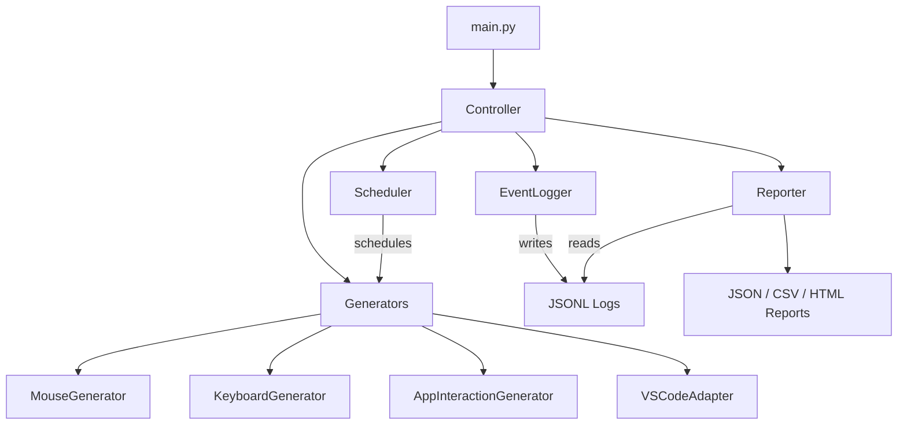

# Developer Activity Simulator -- Implementation Walkthrough

## Summary

Built a complete Python testing harness per [technical.md](file:///d:/Code/jiggler/technical.md) that simulates workstation activity (mouse, keyboard, VS Code, window management) with configurable scenarios, structured logging, and multi-format reporting.

---

## Architecture



---

## Files Created (30 files)

### Core Package -- `simulator/`

| File | Purpose |
|------|---------|
| [__init__.py](file:///d:/Code/jiggler/simulator/__init__.py) | Package root with version and tool name |
| [config.py](file:///d:/Code/jiggler/simulator/config.py) | Pydantic models, YAML loading, validation |
| [controller.py](file:///d:/Code/jiggler/simulator/controller.py) | Central orchestrator with signal handling |
| [scheduler.py](file:///d:/Code/jiggler/simulator/scheduler.py) | Action timing with 4 scheduling strategies |

### Generators -- `simulator/generators/`

| File | Purpose |
|------|---------|
| [base.py](file:///d:/Code/jiggler/simulator/generators/base.py) | Abstract base with ActivityEvent, dry-run, error handling |
| [mouse.py](file:///d:/Code/jiggler/simulator/generators/mouse.py) | 8 actions: realistic/random moves, clicks, scroll, idle |
| [keyboard.py](file:///d:/Code/jiggler/simulator/generators/keyboard.py) | 10 actions: typing, snippets, hotkeys, with WPM-based delays |
| [app_interaction.py](file:///d:/Code/jiggler/simulator/generators/app_interaction.py) | 6 actions: window management via pywinauto + fallback |
| [vscode_adapter.py](file:///d:/Code/jiggler/simulator/generators/vscode_adapter.py) | 11 actions: launch, files, tabs, scroll, find, terminal |

### Scenarios -- `simulator/scenarios/`

| File | Scenario | Pattern |
|------|----------|---------|
| [continuous.py](file:///d:/Code/jiggler/simulator/scenarios/continuous.py) | A | Steady stream, minimal idle |
| [intermittent.py](file:///d:/Code/jiggler/simulator/scenarios/intermittent.py) | B | Burst/idle cycles |
| [edge_timeout.py](file:///d:/Code/jiggler/simulator/scenarios/edge_timeout.py) | C | Idle until timeout threshold, then act |
| [long_duration.py](file:///d:/Code/jiggler/simulator/scenarios/long_duration.py) | D | 8+ hours with health checks every 30 min |
| [randomized.py](file:///d:/Code/jiggler/simulator/scenarios/randomized.py) | E | Fully random actions and timing |

### Logging & Reporting

| File | Purpose |
|------|---------|
| [event_logger.py](file:///d:/Code/jiggler/simulator/logging/event_logger.py) | Thread-safe JSONL logger with session markers |
| [reporter.py](file:///d:/Code/jiggler/simulator/reporting/reporter.py) | Pandas aggregation, matplotlib charts |
| [report.html.j2](file:///d:/Code/jiggler/simulator/reporting/templates/report.html.j2) | Dark-themed HTML template with stats cards and charts |

### Entry Point & Config

| File | Purpose |
|------|---------|
| [main.py](file:///d:/Code/jiggler/main.py) | CLI with argparse (--config, --scenario, --dry-run, etc.) |
| [config.yaml](file:///d:/Code/jiggler/config.yaml) | Default YAML configuration |
| [requirements.txt](file:///d:/Code/jiggler/requirements.txt) | Python dependencies |

---

## Test Results

**62/62 tests passed** in 0.97 seconds.

```
tests/test_config.py ................ 18 passed
tests/test_keyboard_generator.py ... 11 passed
tests/test_mouse_generator.py ...... 10 passed
tests/test_reporter.py ............. 8 passed
tests/test_scenarios.py ............ 6 passed
tests/test_scheduler.py ............ 9 passed
```

---

## Dry-Run Verification

```bash
python main.py --dry-run --duration 1 --scenario continuous
```

- 50 actions logged across all generators
- 0 errors
- Reports generated: JSON, CSV (summary + events), HTML

---

## Usage Examples

```bash
# Default run (60 min, randomized scenario)
python main.py

# Quick dry-run test
python main.py --dry-run --duration 5 --scenario continuous

# Specific scenario with custom seed
python main.py --scenario edge_timeout --seed 42 --duration 30

# Verbose logging with custom report directory
python main.py --verbose --report-dir ./my_reports

# Custom config file
python main.py --config my_config.yaml
```

---

## Key Design Decisions

1. **Plugin-style generators**: Each generator is independent, registered by type string. New generators can be added by extending `BaseGenerator` without modifying existing code.

2. **Seeded RNG throughout**: A single `random.Random` instance is seeded from config and passed to all components, ensuring deterministic runs with `--seed`.

3. **Dry-run mode**: Critical for testing the harness itself. All generators check `self.dry_run` and log actions without triggering actual input events.

4. **JSON Lines logging**: Append-only, one event per line -- efficient for 8+ hour runs and easy to parse incrementally.

5. **Platform detection**: `AppInteractionGenerator` uses `pywinauto` on Windows with automatic `pyautogui` fallback on other platforms.

6. **Graceful shutdown**: SIGINT handler sets a flag that the controller checks between actions, ensuring partial reports are still generated.
